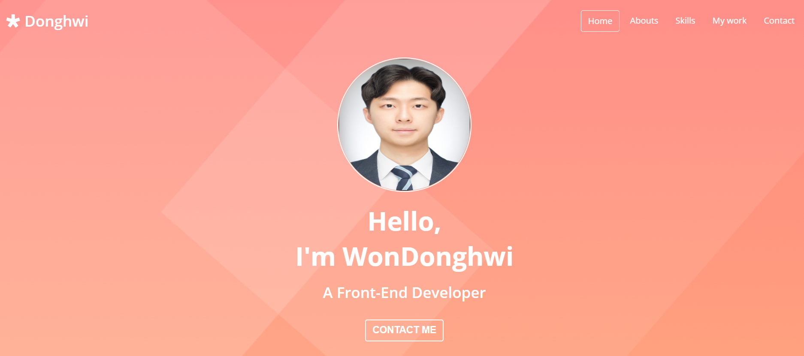
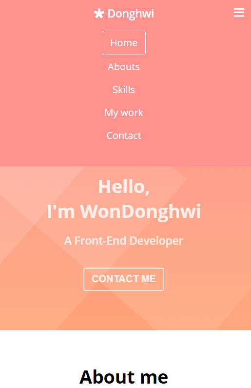

# PortFolio

# <페이지 소개>
## - React , JavaScript , (Html & css)별로 Github에 프로젝트를 포트폴리오로 만들어서 구성했습니다.

# <기술스택>
## Html , Css , vanilaJavascript

### 웹페이지로  포트폴리오  작성

- 포트폴리오 ,  Responsive web 

오직 Html , Css , javascript 만으로 반응형 웹을 구현하였습니다.

### [웹페이지 바로가기](https://wondonghwi.github.io/Portfolio/)

Preview - 768px 이상

Preview - 768px 이하(Tablets + Phones)

